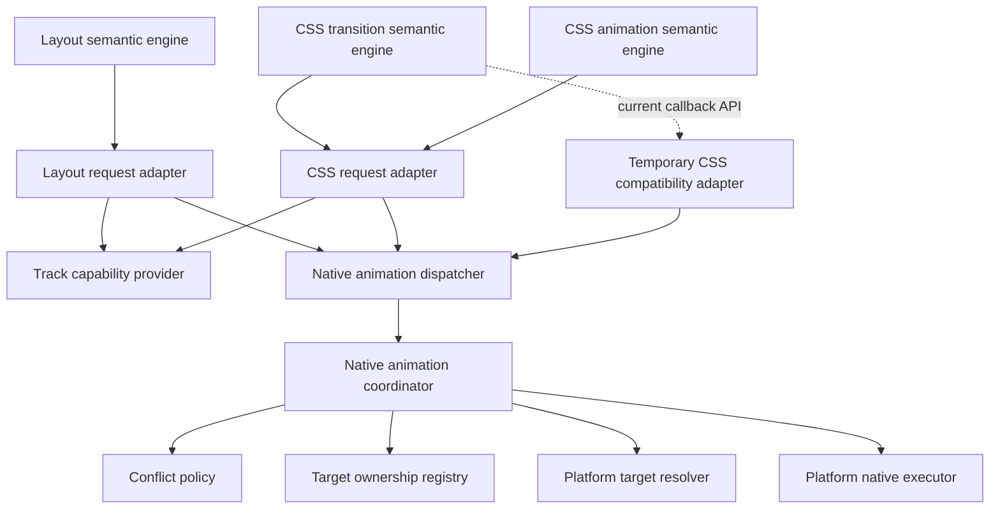
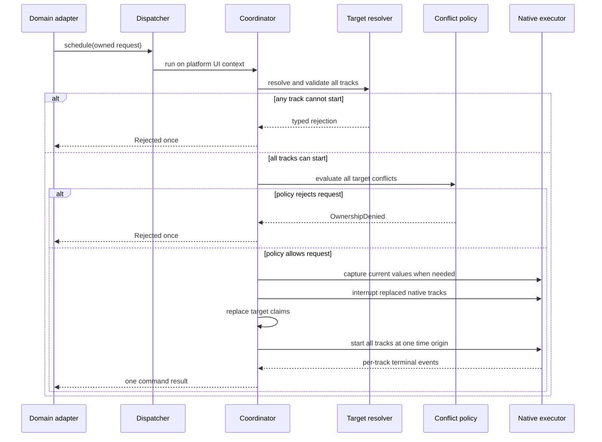

# RFC: Shared Native-Animation Boundary

- Status: proposed
- Date: 2026-07-27

## Summary

Layout animations, CSS transitions, and CSS animations keep separate semantic
engines. They share a low-level service for native animation work.

The shared service provides:

- owned plan, value, target, handle, result, and diagnostic types;
- static capability facts for one track at a time;
- surface-aware target resolution on the platform UI thread;
- exclusive target ownership and conflict handling;
- native schedule, cancel, handoff, and completion operations;
- a lease for a domain fallback driver;
- platform clock conversion;
- current visible value reads during an atomic replacement or handoff.

The shared service does not provide:

- CSS reversal, iteration, direction, fill, or pseudo-selector rules;
- layout builder execution or compilation policy;
- layout mutation interception;
- entering or exiting lifecycle rules;
- domain fallback selection;
- public callback or retained-view cleanup policy.

Version one supports finite, one-shot playback. A domain can group tracks as it
needs. Layout normally submits one group for one builder result. A CSS
transition can submit one group for each property.

The Apple executor should reuse the finite Core Animation work in the current
CSS transition implementation. A temporary compatibility adapter can preserve
the current CSS callback interface. Direct CSS use of the shared ownership
service remains separate, CSS-owned work.

## Proposed agreement

This RFC proposes the following decisions:

- Shared code owns low-level native interaction, not domain semantics.
- A handle uses `(surface, tag, owner, generation)`.
- Conflicts use a separate `(surface, tag, target)` key.
- Disjoint targets can run at the same time.
- Each track selects `ExplicitValue` or `CurrentVisualValue`.
- `cancel` and `handoff` are separate operations.
- Outcomes and capability reasons use typed enums, not Boolean values.
- The dispatcher accepts calls from any thread.
- The coordinator, target registry, resolver, and executor run in one
  serialized platform UI context.
- A command has one time origin. Each track owns its timing and segments.
- Domains check static capabilities before they build sampled data.
- A late, view-dependent capability failure rejects before native start.
- The shared service never selects a fallback.
- Legacy fallback drivers use the same target ownership coordinator.
- Common plans contain owned C++ data. They contain no JSI, `folly::dynamic`,
  Objective-C, JNI, or platform view objects.
- Reduced motion remains domain policy.
- Version one does not replace the existing Reanimated update registries.

The open review items appear in [Open decisions](#open-decisions).

## Problem

The current Apple CSS transition path and the native layout PoC use separate
platform hosts.

```text
CSS C++ router
  -> CSS platform callbacks
  -> REACSSPlatformTransitions
  -> Core Animation

LayoutAnimationsManager
  -> layout platform callbacks
  -> REANodesManager native player
  -> Core Animation
```

Both hosts perform some of the same work:

- find a mounted view and its layer;
- map a logical target to a platform target;
- convert owned values to platform values;
- convert relative time to the layer clock;
- read the current visible value during interruption;
- update the model layer without implicit animation;
- add, replace, and remove native animations.

They do not share ownership. Two hosts can write the same layer property
without one conflict policy, one completion rule, or one key namespace.

The CSS host also mixes CSS rules with Core Animation work. It stores CSS
reversal state beside layer lookup, presentation reads, and animation removal.
That code cannot become the shared service as one unit.

## Goals

1. Define one platform-neutral boundary for low-level native animation work.
2. Keep CSS and layout semantic state machines separate.
3. Support Apple now without adding Apple terms to common code.
4. Leave a clear Android implementation boundary.
5. Let each domain select fallback scope.
6. If needed, resolve target conflicts in one place for all drivers that adopt the
   service.
7. Preserve exactly-once completion for each submitted shared command.
8. Reuse current CSS Core Animation work where its behavior is domain-neutral.
9. Permit staged CSS adoption without duplicate long-term native hosts.

## Non-goals

This RFC does not:

- define the full native intermediate representation;
- define transform operation lowering;
- define native spring support;
- define CSS keyframe routing policy;
- add pause, resume, iteration, direction, fill, or infinite playback;
- define CSS pseudo-selector persistence in shared code;
- replace `UpdatesRegistryManager`;
- coordinate every animated style or commit writer in version one;
- choose the final winner for every CSS-versus-layout conflict;
- modify CSS production code as part of this RFC.

## Terms

### Domain

A domain owns public animation meaning. The domains here are layout
animations, CSS transitions, and CSS animations.

### Shared command

A shared command is one submitted target claim and execution group. It has one
handle and one terminal result.

A public domain animation can use one or more shared commands. Layout will
normally use one shared command. CSS can use one command for each property.

### Track

A track changes one typed target over time. A track owns its delay, segments,
values, and timing curves.

### Target

A target is a platform-neutral visual field, such as opacity or position.
Platform code maps it to a `CALayer` key path or an Android property.

### Claim

A claim is a following structure: `(surface, tag, target)`

A claim gives one animation driver the right to change one visual field of one
view. `surface` identifies the React Native render tree, `tag` identifies the
view in that tree, and `target` identifies the field, such as opacity. The
tuple prevents conflicts between different surfaces or views while still
detecting two drivers that change the same field of the same view.

### External driver

An external driver is a non-native loop that still changes a claimed target.
The current layout and CSS loops are examples. The coordinator grants it a
lease but does not run it.

## Architecture



The boxes have separate duties.

| Part | Duty | Must not do |
| --- | --- | --- |
| Domain semantic engine | Public rules, grouping, fallback, cleanup | Touch platform layers or views |
| Domain request adapter | Convert domain data to common owned data | Select a platform object |
| Capability provider | Report static facts for one track | Select fallback or claim targets |
| Dispatcher | Own request data and dispatch it to the platform UI context | Resolve conflicts or run animations |
| Coordinator | Validate commands and control their lifecycle | Implement CSS or layout rules |
| Conflict policy | Decide allow, replace, or reject | Touch views or start animations |
| Target registry | Store exact and wildcard claims | Choose policy |
| Target resolver | Map a target to a mounted platform object | Own semantic state |
| Native executor | Run physical native tracks | Select fallback or public cleanup |

Use composition between these parts. Do not put all duties in one platform
class.

## Domain and shared responsibilities

### Layout owns

- builder execution and classification;
- direct, structured, sampled, or legacy routing;
- whole-animation fallback;
- layout mutation interception;
- final-state-first mounting;
- entering initial values;
- exiting view retention and deletion;
- public callback mapping;
- reduced-motion policy.

### CSS owns

- transition property selection;
- per-property routing;
- reversal shortening;
- transition settings and CSS defaults;
- pseudo-selector persistence;
- loop interpolation;
- keyframe iteration, direction, fill, and pause rules;
- CSS public callback and registry state.

### Shared code owns

- common values and timing data;
- handle and target identity;
- static capability results;
- surface-aware target claims;
- atomic conflict resolution;
- current visible value access during schedule or handoff;
- physical native execution;
- native cancel and handoff;
- one terminal result for each shared command;
- typed trace and diagnostic data.

## Identity

### Command identity

```cpp
enum class AnimationOwner : uint8_t {
  Layout,
  CSSTransition,
  CSSAnimation,
};

struct AnimationHandle {
  SurfaceId surfaceId;
  Tag tag;
  AnimationOwner owner;
  uint64_t generation;
};
```

The fields have separate roles:

- `surfaceId` scopes the command to one React Native surface and lets surface
  teardown cancel only its commands.
- `tag` identifies the view that the command affects.
- `owner` identifies the domain that created the command, such as layout or a
  CSS transition.
- `generation` distinguishes successive commands from the same domain for the
  same view. It lets the service ignore a late start or completion from an old
  command.

A handle does not contain a target because one command can own several
targets. The target registry records those claims separately.

The domain allocates `generation` when it creates an actual command. A config
change does not allocate a generation.

A higher generation does not make every older command on the tag stale. The
target registry decides conflicts.

### Target identity

```cpp
enum class AnimationTargetKind : uint8_t {
  Opacity,
  Position,
  PositionX,
  PositionY,
  Size,
  Width,
  Height,
  BackgroundColor,
  BorderColor,
  BorderRadius,
  BorderWidth,
  ShadowColor,
  ShadowOpacity,
  ShadowRadius,
  ShadowOffset,
  Transform,
};

struct AnimationTarget {
  AnimationTargetKind kind;
};

struct AllVisualTargets {};

using AnimationTargetClaim =
    std::variant<AnimationTarget, AllVisualTargets>;
```

The exact version-one target list will follow the supported property matrix.
The type must remain extensible.

`AnimationTarget` identifies ownership even when no platform can animate that
target natively. A legacy driver can still claim it.

`AllVisualTargets` is a conservative wildcard for a valid animation whose
exact target set is unknown. It conflicts with every target on the same
surface and tag. The shared service must not silently treat an unknown set as
an empty set.

For example, a stateful custom legacy animation can choose between opacity and
transform only when it runs. Until then, its adapter claims
`AllVisualTargets`.

### Claim key

Exact ownership uses:

```text
(surface, tag, target)
```

### Handle versus claim key

The handle answers “which command is this?” The claim key answers “which
visual field does a command own?”

| Identity | Purpose |
| --- | --- |
| `AnimationHandle(surface, tag, owner, generation)` | Identifies one submitted command. The service uses it for schedule, cancel, handoff, and exactly-once completion. |
| Claim key `(surface, tag, target)` | Identifies one exclusive visual field of one view. The coordinator uses it to detect conflicts. |

One handle can own several claim keys. For example, one layout handle can own
both `(surface, tag, opacity)` and `(surface, tag, position)`. The target
registry maps each claim key to its current handle and driver kind.

## Common values

Domains start with different data forms, and each platform uses different
native objects. The shared service needs owned, typed values so it can validate
tracks, cross scheduler boundaries safely, and send the same plan to Apple or
Android. These values describe execution data, not CSS or layout syntax.

```cpp
struct AnimationPoint {
  double x;
  double y;
};

struct AnimationSize {
  double width;
  double height;
};

struct AnimationColor {
  double red;
  double green;
  double blue;
  double alpha;
};

struct AnimationMatrix4 {
  std::array<double, 16> values;
};

using AnimationValue = std::variant<
    double,
    AnimationPoint,
    AnimationSize,
    AnimationColor,
    AnimationMatrix4>;
```

Rules:

- Lengths use logical points.
- Time uses milliseconds.
- Angles use radians.
- Colors use red, green, blue, and alpha channels.
- Matrix values contain 16 finite numbers.
- Every number must be finite.
- A target defines which value kinds it accepts.
- Common values do not contain JSI, `folly::dynamic`, Objective-C objects, JNI
  objects, `CALayer`, Android `View`, or platform colors.
  - Why: Requests must own safe data across scheduler and platform boundaries.

The current CSS `PlatformValue` is close to this shape. The shared type must
replace array-length meaning with named types. A two-number array must not
mean either a point or a size based on hidden context.

The exact ordered-transform or matrix policy remains follow-up work.

## Timing and tracks

One command has one time origin. Tracks do not need one common duration.

```cpp
// Selects whether the domain supplies the start or the executor reads it.
enum class StartValueSource : uint8_t {
  ExplicitValue,
  CurrentVisualValue,
};

// Stores a platform-neutral cubic Bézier timing curve.
struct CubicBezier {
  double x1;
  double y1;
  double x2;
  double y2;
};

// Marks a linear timing curve without extra parameters.
struct LinearTiming {};

// Lists the timing curves that the common plan can carry.
using AnimationTiming = std::variant<LinearTiming, CubicBezier>;

// Stores one track value, its time, and the curve to the next value.
struct AnimationKeyframe {
  double offsetMs;
  AnimationValue value;
  AnimationTiming timingToNext;
};

// Describes the complete value timeline for one visual target.
struct AnimationTrack {
  AnimationTarget target;
  StartValueSource startSource;
  std::optional<AnimationValue> explicitStart;
  std::vector<AnimationKeyframe> keyframes;
};

// Runs tracks over time or applies endpoints now while still resolving ownership and completion.
enum class PlaybackMode : uint8_t {
  Animated,
  Immediate,
};

// Groups tracks that share one command time origin and playback mode.
struct AnimationPlan {
  PlaybackMode mode;
  std::vector<AnimationTrack> tracks;
};

// Binds one owned plan to its lifecycle and ownership identity.
struct AnimationRequest {
  AnimationHandle handle;
  AnimationPlan plan;
};
```

This is contract pseudocode. Follow-up implementation work will define the
exact intermediate representation.

Rules:

- The first keyframe offset includes any track delay.
  - Why: One timeline represents both delay and playback.
- Each track can have a different delay, duration, and segment count.
  - Why: One command can contain simple and complex target timelines.
- Every track uses the command's common time origin.
  - Why: Tracks stay synchronized without requiring the same duration.
- `ExplicitValue` requires an owned start value.
  - Why: The executor must not depend on domain or runtime state later.
- `CurrentVisualValue` asks the executor to read the current rendered value at
  the atomic start.
  - Why: An interruption can continue without a visible jump or a read race.
- The domain selects the start rule.
  - Why: CSS and layout know the animation meaning; the executor does not.
- Entering animations will normally use `ExplicitValue`.
  - Why: The entering state defines its initial appearance directly.
- A replacement will normally use `CurrentVisualValue`.
  - Why: The new animation should start from what the user currently sees.
- `Immediate` still claims and preempts targets. It then applies or reveals the
  endpoint without a physical animation.
  - Why: Reduced motion and zero duration still need conflict handling and one
    completion.

The common plan contains only execution data. It does not contain a layout
callback, an exit rule, CSS state, or a builder.

## Capability model

Not every platform can run every target, value type, timing curve, or
animation form natively. Before a domain selects native playback, it must know
whether the shared service can run the proposed track without changing its
meaning.

The capability model reports these facts. It does not select native or legacy
playback. Layout or CSS uses the result to make that choice at its required
scope.

The check has two stages because some facts are known from types, while others
depend on the mounted view:

1. A static check rejects known unsupported track forms before the domain
   builds a full plan.
2. A resolved check confirms that the mounted view has a usable platform
   target before the coordinator changes ownership or starts playback.

For example, Apple can support a border value and timing curve in general, but
a specific mounted component can render its border through a path that the
native executor cannot animate safely.

### Static track capability

The domain can query one track before it builds sampled arrays or a full plan.

```cpp
enum class AnimationPrimitive : uint8_t {
  BasicTiming,
  FiniteKeyframes,
};

enum class AnimationValueKind : uint8_t {
  Scalar,
  Point,
  Size,
  Color,
  Matrix4,
};

enum class AnimationTimingKind : uint8_t {
  Linear,
  CubicBezier,
};

enum class CapabilityReason : uint8_t {
  Supported,
  UnsupportedTarget,
  UnsupportedValueKind,
  UnsupportedTiming,
  UnsupportedPrimitive,
  InvalidValue,
  ResourceLimit,
};

struct TrackCapabilityQuery {
  AnimationTarget target;
  AnimationPrimitive primitive;
  AnimationValueKind valueKind;
  AnimationTimingKind timingKind;
};

struct CapabilityResult {
  CapabilityReason reason;
};

class AnimationCapabilityProvider {
 public:
  virtual ~AnimationCapabilityProvider() = default;

  virtual CapabilityResult query(
      const TrackCapabilityQuery &query) const = 0;
};
```

The result is a fact. It is not a routing order.

The static provider uses immutable support data. It does not access a mounted
view or another platform object. Domain compilers can therefore call it before
they post work to the platform UI context.

Layout can query every planned track and route the complete logical animation
to legacy if any track is unsupported.

CSS transitions can query each property and route supported properties to
native playback while other properties stay on the loop.

CSS keyframe routing remains a CSS decision.

### Resolved target capability

Some support depends on the mounted view. For example, React Native can render
a border through a path that does not map to one usable Core Animation target.

The coordinator therefore performs a second check on the platform UI thread:

1. Resolve the mounted view and target.
2. Check that the resolved platform target supports the requested values and
   primitive.
3. Validate every track in the command.
4. If any check fails, reject before it preempts an old owner.

The shared result contains a typed reason. The domain then selects its
fallback. The shared service does not start fallback work.

This second check does not replace the static check. It covers facts that do
not exist before mount and target resolution.

## Results and diagnostics

Each shared command ends once. Its result answers two separate questions:

- `outcome`: What happened to the command lifecycle?
- `reason`: Why did that outcome occur, when more detail is useful?

The domain uses the outcome for lifecycle handling and the reason for fallback
decisions, logs, and development diagnostics. The result describes only the
shared command. The domain still decides the public animation result and
cleanup.

```cpp
// Describes how the shared command reached its terminal state.
enum class AnimationOutcome : uint8_t {
  Finished,         // All tracks finished, or their endpoints were applied immediately.
  Cancelled,        // The owner explicitly stopped the command.
  Interrupted,      // Another accepted command replaced at least one claim.
  Rejected,         // Validation or policy stopped the command before native start.
  Failed,           // Native execution started but could not complete safely.
  SurfaceDestroyed, // The React Native surface ended before the command did.
};

// Gives the specific cause when the outcome alone is not enough.
enum class AnimationResultReason : uint8_t {
  None,                         // No extra cause is needed.
  TargetUnavailable,            // The requested view or platform target does not exist.
  UnsupportedTargetRealization, // This mounted view cannot expose a safe native target.
  CurrentValueUnavailable,      // The executor cannot read a required current visual value.
  StaleGeneration,              // This command is no longer current for its recorded claims.
  InvalidPlan,                  // The plan has invalid or inconsistent execution data.
  OwnershipDenied,              // Conflict policy did not grant the requested claims.
  ExecutorError,                // The platform animation API reported an execution error.
  ResourceLimit,                // The request exceeds a safe platform or service limit.
};

// Combines the terminal lifecycle state with its optional detailed cause.
struct AnimationResult {
  AnimationOutcome outcome;
  AnimationResultReason reason;
};
```

Each shared command receives one terminal result. Late executor callbacks do
not produce another result.

`Rejected` means that native execution did not start. The domain can then
inspect the reason and start its fallback when its contract permits. The
rejection ends the shared command, not necessarily the public domain
animation.

The domain maps the shared result to its public result:

- layout maps natural native or legacy completion to its public Boolean;
- layout owns retained-exit deletion;
- CSS owns registry and callback cleanup;
- an immediate reduced-motion request maps `Finished` to public success.

Development traces should include:

- surface;
- tag;
- owner;
- generation;
- targets;
- requested route;
- selected route;
- result;
- reason.

No track can disappear without a typed reason.

## Public operations

Names in this section are illustrative.

```cpp
using TerminalCallback = std::function<void(AnimationResult)>;

struct ExternalClaimRequest {
  AnimationHandle handle;
  std::vector<AnimationTargetClaim> targets;
};

enum class ExternalClaimStatus : uint8_t {
  Granted,
  Rejected,
};

struct ExternalClaimResult {
  ExternalClaimStatus status;
  AnimationResultReason reason;
};

struct CapturedTargetValue {
  AnimationTarget target;
  AnimationValue value;
};

struct HandoffResult {
  ExternalClaimResult claim;
  std::vector<CapturedTargetValue> currentValues;
};

using HandoffCallback = std::function<void(HandoffResult)>;

struct ExternalClaimCallbacks {
  std::function<void(ExternalClaimResult)> onClaim;
  TerminalCallback onTerminal;
};

class NativeAnimationService {
 public:
  virtual ~NativeAnimationService() = default;

  virtual void schedule(
      AnimationRequest request,
      TerminalCallback terminal) = 0;

  virtual void cancel(AnimationHandle handle) = 0;

  virtual void handoffToExternal(
      AnimationHandle nativeHandle,
      ExternalClaimRequest replacement,
      HandoffCallback callback) = 0;

  virtual void claimExternal(
      ExternalClaimRequest request,
      ExternalClaimCallbacks callbacks) = 0;

  virtual void releaseExternal(
      AnimationHandle handle,
      AnimationOutcome outcome) = 0;

  virtual void cancelSurface(SurfaceId surfaceId) = 0;
};
```

### `schedule`

`schedule` owns the request after the call. It validates, resolves, claims, and
starts all tracks as one atomic operation on the platform UI thread.

A native-to-native replacement occurs inside `schedule`. The coordinator reads
current visible values for tracks that use `CurrentVisualValue`, interrupts
the old claim, installs the new claim, and starts the new tracks without a
visible gap.

### `cancel`

`cancel` stops physical playback, releases claims, and reveals or applies the
committed model value. It does not delete an exiting view and does not run
domain cleanup.

### `handoffToExternal`

`handoffToExternal` moves a native claim to a fallback or other external
driver. The coordinator:

1. reads the current visible values;
2. removes the native animations;
3. transfers the target claims;
4. returns the captured values to the domain adapter.

The operation is atomic on the platform UI thread. The domain starts its loop
from the returned values.

Do not expose a general `readPresentation` operation. A public read followed by
a later cancel or schedule creates a race. Presentation access stays inside
atomic schedule and handoff operations.

### `claimExternal`

`claimExternal` asks the coordinator for an ownership lease before an existing
non-native loop starts. The claim callback reports `Granted` or `Rejected`.
After a grant, the terminal callback tells the driver when the coordinator
revokes its lease. The coordinator does not run the loop.

The external driver must:

- wait until the claim succeeds before it starts;
- stop when the coordinator revokes the lease;
- report its terminal outcome once;
- release the lease on completion or cancellation.

An exact known target uses an exact claim. A driver with an unknown target set
uses `AllVisualTargets`.

Use `claimExternal` for fallback selected before native start. Use
`handoffToExternal` when an active native command must transfer its current
values to the external driver.

### `releaseExternal`

`releaseExternal` tells the coordinator that the external driver has finished,
cancelled, or failed. The coordinator releases its claims and closes the
external command once. The driver must not change those targets after release.

### `cancelSurface`

`cancelSurface` ends every native command and external lease for one React
Native surface. It clears their claims and reports `SurfaceDestroyed` once for
each command. It does not run per-view cleanup on the destroyed surface.

## Atomic schedule order

The `alt` frames in this Mermaid sequence diagram show mutually exclusive
`if/else` branches. Only one path in each frame runs.



The coordinator must not interrupt an old owner before every new track passes
resolved validation and the policy accepts the full claim change.

## Conflict rules

The registry supports these rules:

- Disjoint exact targets can coexist.
  - Why: A change to opacity must not stop an unrelated position animation.
- An exact target conflicts with the same exact target.
  - Why: Two drivers must not control one visual field at the same time.
- `AllVisualTargets` conflicts with all exact and wildcard claims on the same
  surface and tag.
  - Why: An unknown target set can include any visual field on that view.
- A newer generation alone does not cancel an older disjoint claim.
  - Why: Generations identify commands, while target claims decide conflicts.
- A surface teardown ends all claims on that surface.
  - Why: The claimed views and platform targets no longer exist.
- A fallback driver cannot bypass the registry.
  - Why: Native and loop drivers need the same conflict rules.

The conflict policy is a separate object. It returns a typed action such as:

```cpp
enum class ConflictAction : uint8_t {
  Allow,
  Replace,
  Reject,
};
```

The target registry stores the result. It does not choose the result.

Same-owner replacement uses latest-command-wins. Cross-owner priority remains
an open review item. The mechanism must support a later policy change without
changes to target resolution or physical execution.

When a new claim replaces only part of an old shared command, the old command
ends with `Interrupted`. Unaffected physical tracks must not jump. Follow-up
ownership work will define the exact transfer or recompilation operation.

## Thread and lifetime contract

The public dispatcher accepts calls from any thread.

Before a request crosses a scheduler boundary, the dispatcher takes ownership
of:

- the handle;
- the plan;
- all targets;
- all values;
- all timing data;
- callback state.

The dispatcher uses the Worklets UI scheduler to reach the serialized platform
UI context. In the current Apple and Android hosts, that scheduler runs work on
the platform UI thread.

The coordinator, conflict policy, target registry, target resolver, and native
executor require that UI context. They do not add another normal thread hop.
Debug builds should assert the required context.

Domain lifecycle state must only change on its selected scheduler. If a
platform completion enters on another callback path, the dispatcher posts it
to the domain scheduler before it calls domain code.

No shared object can store:

- `jsi::Runtime`;
- `jsi::Value`;
- `jsi::Object`;
- a borrowed `folly::dynamic`;
- a borrowed platform view or layer across a mount boundary.

A domain adapter can read JSI synchronously. It must convert the result to
owned common C++ data before it calls the shared service.

## Clock contract

- Common plans use relative milliseconds.
- One command uses one monotonic time origin.
- The platform adapter converts that origin to its local clock.
- The Apple executor must convert absolute media time with
  `[layer convertTime:fromLayer:]`.
- The Android adapter chooses the matching platform time source.
- A slow-animation debug setting is a platform concern. It must not change
  common plan values.

The current `OperationsLoop::resolveTimestamp()` can remain the injected
Reanimated clock source. The shared service must not create a second domain
clock.

## Start values and interruption

The domain selects a start rule for each track.

Use `ExplicitValue` when the semantic engine knows the required initial
appearance. Entering animation is the main case.

Use `CurrentVisualValue` when a replacement must continue from what the user
currently sees.

On Apple, the executor can read a presentation layer. On Android, the executor
must read the current value from the chosen platform animation or view target.
The common API does not use the term `presentation layer`.

If the platform cannot read a current value for the resolved target, it rejects
before it changes claims. It must not use a guessed value.

## Cancellation and domain cleanup

Physical cancellation and domain cleanup are separate.

The shared service:

- stops native playback;
- controls visible-to-model settlement;
- releases target claims;
- reports one result.

The domain:

- maps the result to its public callback;
- removes a retained exiting view;
- updates its CSS or layout registry;
- starts fallback when allowed.

A normal `cancel` settles to the committed model state. A `handoffToExternal`
captures current visible values and transfers ownership. A native-to-native
replacement performs the same capture inside `schedule`.

This split removes the need for one Boolean such as `usePresentationLayer`.

## Reduced motion and zero duration

The domain evaluates reduced-motion policy.

When the domain selects a skip, it sends `PlaybackMode::Immediate`. The shared
service still:

- validates the command;
- applies conflict policy;
- replaces conflicting claims;
- applies or reveals endpoints;
- returns `Finished`.

It creates no physical animation and ignores track delay.

An explicit zero-duration animation can use the same immediate execution path.
The domain retains the reason for public diagnostics.

## Routing and fallback

The shared layer reports facts. The domain decides route and grouping.

### Layout

Layout uses whole-animation fallback:

1. Run the builder once with the required Yoga values.
2. Inspect stable graph or structural metadata.
3. Query static capability for every proposed track.
4. Select direct basic, structured finite, sampled deterministic, or legacy.
5. If a resolved native target rejects before start, inspect the typed reason.
   Route the complete logical animation to legacy only when the domain
   contract permits fallback for that reason.
6. Once native execution starts, do not switch to legacy after failure.

The compiler should query capabilities before it creates sampled arrays.

### CSS transitions

CSS keeps per-property routing:

1. Parse one property and its CSS settings.
2. Convert it to an owned common target, value, and timing query.
3. Query static capability.
4. Submit a native command for that property or keep that property on the
   loop.
5. If resolved native validation rejects before start, inspect the typed
   reason. Route that property to the loop only when the CSS contract permits
   fallback for that reason.

One CSS transition can therefore run property A natively and property B on the
loop.

### CSS animations

CSS owns the routing unit. The shared service supports granular track and claim
operations, but this RFC does not define CSS keyframe grouping, iteration, or
fallback policy.

## Reuse of the current CSS implementation

The current CSS platform transition path contains useful production work. We
should reuse the domain-neutral parts.

### Keep in CSS

- `CSSTransitionsManager` normalization and diffs;
- `CSSTransitionConfig` parsing and CSS defaults;
- `CSSTransition` and `CSSTransitionRouting`;
- `CSSPlatformTransitionProxy` per-property routing;
- reversal shortening;
- pseudo-selector persistence;
- `CSSLoopTransition` and transition progress;
- CSS keyframe and animation registry rules.

The current Apple `ActiveTransition` state contains CSS reversal data and CSS
settings. Move it to a CSS-owned C++ adapter if the code is refactored. Do not
move it into the shared coordinator or executor.

### Extract into shared common code

- the shape behind CSS `PlatformValue`, with explicit named value types;
- neutral linear and cubic-Bézier timing data;
- target and result types.

CSS parsing remains a domain adapter because it applies CSS defaults and reads
JSI or `folly::dynamic`.

### Extract into the Apple host

- common-value to Core Animation value conversion;
- common-timing to `CAMediaTimingFunction` conversion;
- surface-aware view and layer lookup;
- target-to-layer and key-path resolution;
- current presentation value reads;
- layer-local clock conversion;
- disabled implicit actions;
- model value commit for finite playback;
- native animation add, replace, remove, and completion work.

### Replace instead of reuse

- raw CSS property strings as platform targets;
- raw key paths as animation ownership keys;
- tag-only view lookup;
- the Objective-C++ `_active[tag][property]` map as shared ownership;
- the current Boolean route and apply results;
- the current `removeTransition` operation that mixes handoff and cancel;
- silent return when the mounted layer cannot be found;
- the four CSS-specific callbacks as the long-term platform boundary.

### Temporary CSS compatibility adapter

Both layout and CSS need permanent domain request adapters:

```text
Layout rules -> layout request adapter -> shared service
CSS rules    -> CSS request adapter    -> shared service
```

CSS also needs a temporary compatibility adapter because it has a current
callback interface:

```text
Current CSS callbacks
  -> temporary compatibility adapter
  -> shared service
```

This adapter lets an implementation extract Core Animation work without an
immediate CSS routing rewrite.

Persistent pseudo-selector transitions do not fit finite, one-shot version
one. They remain on a CSS-specific path until a reviewed extension supports
their persistence rules.

The current `CSSPlatformAnimationFactory` is a CSS routing interface. It can
later use the shared service, but it is not the common executor contract.

## Staged implementation

### Stage 1: common contracts and Apple extraction

- Add common owned handle, target, value, timing, result, capability, and
  diagnostic types.
- Add the dispatcher, coordinator, conflict policy, target registry, resolver,
  and executor interfaces.
- Extract finite Core Animation operations from the current CSS Apple code.
- Keep current CSS behavior through a compatibility adapter.
- Keep CSS semantic and persistent paths in CSS.
- Require CSS-owner review for the behavior-preserving extraction.

This stage reuses CSS platform work. It does not require direct CSS ownership
service adoption.

### Stage 2: layout adoption

- Add the layout request adapter.
- Replace layout-specific native player hooks with the shared service.
- Give the legacy layout driver an external ownership lease.
- Keep layout whole-animation fallback.
- Add Apple behavior and fake cross-platform tests.

### Stage 3: direct CSS transition adoption

This is separate CSS-owned work:

- replace the temporary callback adapter with direct shared service calls;
- add surface identity to CSS commands;
- register one target claim for each native or loop-routed property;
- use `handoffToExternal` for native-to-loop migration;
- keep CSS reversal and pseudo rules in CSS;
- verify existing per-property behavior.

### Stage 4: optional CSS animation adoption

The CSS owner can later decide how finite CSS keyframes use the service.
Iteration, direction, fill, pause, resume, and infinite playback need a later
contract.

## Rollout rule

Do not enable native layout animations in production while the current native
CSS transition path can write the same target without shared ownership.

Production rollout requires one of:

1. CSS transitions register target claims through the shared coordinator.
2. The team approves a temporary guard that prevents known cross-domain
   conflicts.

The guard and its removal condition require review.

Version one does not replace `UpdatesRegistryManager`. Existing priority
between CSS transitions, animated props, and CSS animations remains in place.
Any interaction between that commit priority and native target claims must be
documented as a rollout risk.

## Examples

### Layout direct timing

Layout produces one command with opacity and position tracks. Both pass static
capability. The coordinator resolves both targets, claims them atomically, and
starts them at one time origin. Layout receives one terminal result.

### Layout legacy lease

A builder contains an unsupported callback. Layout selects legacy before
native execution. It claims the exact known targets, or `AllVisualTargets` when
it cannot prove the set. The coordinator grants a lease. The existing legacy
engine then runs the animation.

### CSS per-property routing

A CSS transition changes opacity and a border property.

- Opacity passes capability and starts as one native shared command.
- The mounted view cannot expose a valid native border target.
- The border command receives `Rejected` before it changes ownership.
- CSS runs only the border property on its loop.

The shared service does not combine both properties and does not choose the
loop.

### CSS reversal

CSS detects a reversal and computes the shortened duration and new easing. It
submits a new opacity command with `CurrentVisualValue`.

The coordinator reads the current native value and replaces the old opacity
claim. It does not know that the request is a CSS reversal.

### CSS keyframes with iteration

A CSS animation has three keyframes, alternate direction, and four iterations.
Version one cannot express the full playback rules. CSS keeps the animation on
its current engine. The shared service does not receive a partial finite plan.

### Immediate completion

Layout selects reduced-motion skip. It submits an immediate plan. The
coordinator resolves conflicts, applies the endpoint, and reports `Finished`.
Layout then performs its callback and any exit cleanup.

### Cancel

The domain cancels a command. The coordinator removes native tracks, reveals
the committed model values, releases claims, and reports `Cancelled`. The
domain performs public cleanup.

### Native-to-loop handoff

CSS can no longer route a property natively. It requests
`handoffToExternal`. The coordinator captures the current visible value,
removes the native track, transfers the claim, and returns the value. CSS
starts its loop from that value.

### Disjoint targets

Layout owns position. CSS owns opacity on the same surface and tag. Both claims
remain active because their targets differ.

### Unknown legacy target set

A custom legacy animation has no safe target list. It claims
`AllVisualTargets`. The coordinator does not start a new exact target claim on
that view until the wildcard lease ends or policy replaces it.

## Platform notes

### Apple

The Apple adapter can use:

- `CALayer` and typed key paths inside the target resolver;
- presentation-layer values for `CurrentVisualValue`;
- `CAMediaTimingFunction`;
- `CATransaction` with disabled actions;
- layer-local `convertTime`.

None of these types enter common headers.

Finite animations must commit the endpoint to the model and remove physical
animation state after completion. This prevents animation state from remaining
on a recycled layer.

Native animation keys must include the shared handle and target. They must not
use only the raw Core Animation key path.

### Android

The common contract assumes only:

- a serialized platform UI context;
- mounted target lookup;
- typed current-value reads when supported;
- finite native timing or keyframe playback;
- cancel, handoff, and completion signals.

The Android team chooses the host boundary. It can use a C++ adapter with JNI,
Kotlin, or Java code. Common headers must not require an Android
`View`, property name, density unit, animator object, or JNI container.

Android must document how each supported target reads `CurrentVisualValue`.
Unsupported reads return a typed pre-start rejection.

## Test plan

This RFC needs design and compile-contract evidence. Follow-up implementation
work will add the production skeleton.

### Common fake tests

Use the same common request fixtures with fake Apple and Android executors.
Test:

- an owned plan survives after caller data is destroyed;
- common fixtures contain no platform type or conditional compilation;
- static capability returns a typed result for one track;
- resolved target rejection preempts nothing;
- disjoint targets coexist;
- same targets reach the conflict policy;
- wildcard claims conflict with all exact targets;
- a higher generation does not cancel an older disjoint claim;
- native-to-native replacement uses current visible values;
- native-to-loop handoff transfers current values and ownership;
- cancel and handoff have different effects;
- an immediate request still resolves ownership;
- one command receives one terminal result;
- duplicate and late platform events do not repeat completion;
- surface teardown ends all surface claims;
- calls from a non-UI thread reach the required UI context.

### Domain routing examples

Test:

- one unsupported layout track routes the whole logical animation to legacy;
- one unsupported CSS transition property leaves other supported properties on
  native playback;
- the shared layer never starts fallback;
- a rejected native CSS property can start the CSS loop;
- CSS reversal data stays outside the common request;
- layout exit cleanup stays outside the common result handler.

### Apple regression tests

Add focused tests for behavior extracted from the CSS host:

- layer-local time conversion;
- interruption from the presentation value;
- finite model commit and physical animation removal;
- no animation state on a recycled layer;
- missing view and missing layer return one typed rejection;
- native animation keys include handle and target;
- cancel versus handoff;
- exactly-once delegate completion.

### Review walkthroughs

Walk these sequences with the CSS and Android reviewers:

1. CSS replaces CSS on one target.
2. Layout replaces layout on one target.
3. CSS and layout use disjoint targets.
4. CSS and layout request the same target.
5. A native property moves to the CSS loop.
6. A layout command falls back as a whole.
7. A mounted component has no usable native border target.
8. A surface ends while native and external claims exist.

## Open decisions

The following items need explicit review. They are not hidden implementation
choices.

### [REVIEW REQUIRED] Same-target CSS and layout priority

The registry and conflict policy support replacement or rejection. The team
must choose the winner when CSS and layout request the same non-geometry
target.

### [REVIEW REQUIRED] Geometry priority

The current layout contract proposes that layout owns geometry. The CSS owner
must review the exact geometry target list and the behavior of a conflicting
CSS transition.

### [REVIEW REQUIRED] Retained-exit priority

The current layout contract proposes that an active exit keeps priority until
deletion. The layout and CSS owners must review later claims against that
logically removed view.

### [REVIEW REQUIRED] Temporary rollout guard

The team must select the guard used before CSS registers shared claims. The
review must also state when the guard can be removed.

### [REVIEW REQUIRED] CSS handoff behavior

The CSS owner must confirm the exact state update when a native property moves
to the loop and when a loop property moves to native playback.

### [REVIEW REQUIRED] Android current-value mapping

The Android owner must map each proposed target to a safe current-value read or
mark it unsupported.

### [DEFERRED] Transform representation

A follow-up design will decide ordered transform operations, matrices,
transform origin, and target granularity.

### [DEFERRED] Names and file placement

The type and class names in this RFC show duties. The implementation proposal
will select final names and paths after owner review.

## Rejected alternatives

### Share only utility functions

This leaves target ownership, interruption, and exactly-once completion split
between platform hosts.

### Share one high-level animation engine

This would mix CSS and layout semantic rules. Their lifecycle and fallback
units differ.

### Let the shared service select fallback

The service cannot know whether layout must fall back as one unit or CSS can
split by property.

### Expose a general presentation read

A read followed by a later command is not atomic. The value can change between
the calls.

### Store JSI values until platform start

The platform start can occur after the source runtime call. A stored JSI value
would cross an unsafe lifetime and thread boundary.

### Use one Boolean for cancel behavior

Cancel and handoff have different effects. Typed operations make the required
state change clear.

### Make generation the tag-wide winner

This would cancel unrelated older targets and break disjoint-target
coexistence.

### Require full CSS migration before layout work

This would block layout on separate CSS-owned semantics. A compatibility
adapter permits reuse without that dependency.

### Build a separate layout-only Core Animation host

This would copy current CSS platform work and retain two long-term ownership
systems.

## Acceptance criteria

This RFC passes review when:

- the CSS owner accepts the shared scope or records objections;
- an Android-aware reviewer confirms that common types contain no
  Apple-specific assumption;
- the layout owner accepts the routing, ownership, cancel, handoff, and result
  contract;
- the RFC lists all domain-specific rules;
- the RFC includes typed common pseudocode and cross-domain examples;
- the RFC records the open conflict and rollout decisions;
- no CSS implementation change is required to accept this RFC.

## Review record

| Role | Reviewer | Date | Result |
| --- | --- | --- | --- |
| Layout owner | TBD | TBD | Pending |
| CSS transition/animation owner | TBD | TBD | Pending |
| Android-aware reviewer | TBD | TBD | Pending |
| Apple executor reviewer | TBD | TBD | Pending |

Any material contract change after sign-off must repeat this review.

## References

- [Current platform dependency holder](../../packages/react-native-reanimated/Common/cpp/reanimated/Tools/PlatformDepMethodsHolder.h)
- [Current CSS transition proxy](../../packages/react-native-reanimated/Common/cpp/reanimated/CSS/core/transition/CSSPlatformTransitionProxy.h)
- [Current Apple CSS transition host](../../packages/react-native-reanimated/apple/reanimated/apple/CSS/REACSSPlatformTransitions.mm)
- [Current CSS platform values](../../packages/react-native-reanimated/Common/cpp/reanimated/CSS/utils/platform.h)
- [Current Apple CSS value conversion](../../packages/react-native-reanimated/apple/reanimated/apple/CSS/REACSSPlatformProps.mm)
- [Current CSS platform animation factory](../../packages/react-native-reanimated/Common/cpp/reanimated/CSS/core/CSSPlatformAnimationFactory.h)
- [Current layout native player hook](../../packages/react-native-reanimated/Common/cpp/reanimated/LayoutAnimations/LayoutAnimationsManager.h)
- [Current operations clock](../../packages/react-native-reanimated/Common/cpp/reanimated/Fabric/updates/OperationsLoop.h)
