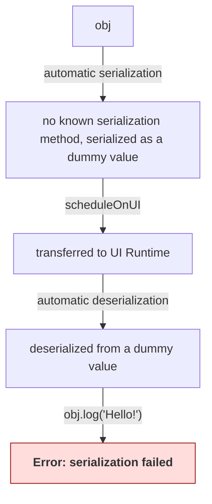
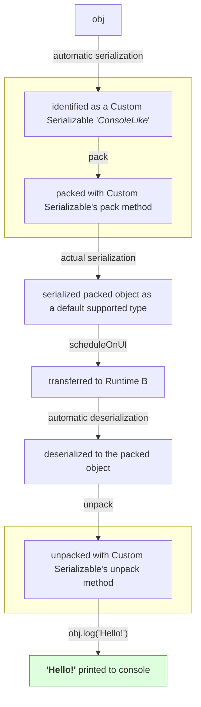

# registerCustomSerializable <AvailableFrom version="0.7.0" />

`registerCustomSerializable` lets you register your own pre-serialization and post-deserialization logic. This is necessary for objects with prototypes different than just `Object.prototype` or some other built-in prototypes like `Map` etc. Worklets can't handle such objects by default to convert into [Serializables](/docs/memory/serializable) hence you need to register them as **Custom Serializables**. This way you can tell Worklets how to transfer your custom data structures between different Runtimes without manually serializing and deserializing them every time.

List of supported types for Serialization can be found [here](/docs/memory/serializable#supported-types).

## Reference

```typescript
const obj = { a: 42 };
Object.setPrototypeOf(obj, console); // because why not

type ConsoleLike = typeof console;

registerCustomSerializable({
  name: 'ConsoleLike',
  determine(value: object): value is ConsoleLike {
    'worklet';
    return Object.getPrototypeOf(value) === console;
  },
  pack(value: ConsoleLike) {
    'worklet';
    return { a: value.a }; // transfer data
  },
  unpack(value: object) {
    'worklet';
    // recreate object with prototype
    return Object.create(console, value);
  },
});
```

<details>
<summary>Type definitions</summary>

```typescript
function registerCustomSerializable<
  TValue extends object,
  TPacked extends object,
>(registrationData: RegistrationData<TValue, TPacked>): void;

type RegistrationData<TValue extends object, TPacked = unknown> = {
  name: string;
  determine: (value: object) => value is TValue;
  pack: (value: TValue) => TPacked;
  unpack: (value: TPacked) => TValue;
};
```

</details>

## Arguments

### registrationData

An object containing the registration data for the Custom Serializable.

Available properties:

| Name      | Type                                 | Description                                                                                                                                                                                                                                                                                              |
| --------- | ------------------------------------ | -------------------------------------------------------------------------------------------------------------------------------------------------------------------------------------------------------------------------------------------------------------------------------------------------------- |
| name      | `string`                             | A unique name for the Custom Serializable. It's used to prevent duplicate registrations of the same Custom Serializable. You will get warned if you attempt to register a Custom Serializable with a name that has already been used.                                                                    |
| determine | `(value: object) => value is TValue` | A [worklet](/docs/fundamentals/glossary#worklet) that checks whether a given JavaScript value is of the type handled by this Custom Serializable.                                                                                                                                                        |
| pack      | `(value: TValue) => TPacked`         | A [worklet](/docs/fundamentals/glossary#worklet) that packs the JavaScript value of type `TValue` into a value that can be serialized by default as [Serializable](/docs/memory/serializable). The function must return a [supported type for Serialization](/docs/memory/serializable#supported-types). |
| unpack    | `(value: TPacked) => TValue`         | A [worklet](/docs/fundamentals/glossary#worklet) that unpacks the packed value, after it's been deserialized from it's packed form, back into the JavaScript value of type `TValue`.                                                                                                                     |

## Motivation

Custom prototypes are bound to a single Runtime and don't exist in other Runtimes. Due to that it's impossible to transfer them between runtimes directly. This is why a pre-serialization (packing) and pre-deserialization (unpacking) logic is required.

Consider the following examples:

<table>
<tr style={{padding: '20px'}}>
<td>

```typescript
const obj = {};

// because why not
Object.setPrototypeOf(obj, console);

scheduleOnUI(() => {
  // This will throw because `obj`
  // had a custom prototype and
  // it couldn't be serialized.
  obj.log('Hello!');
});
```

</td>
<td style={{textAlign: 'center', flex: 1}}>



</td>
</tr>
<tr>
<td>

```typescript
const obj = {};

// because why not
Object.setPrototypeOf(obj, console);

type ConsoleLike = typeof console;

registerCustomSerializable({
  name: 'ConsoleLike',
  determine(value: object): value is ConsoleLike {
    'worklet';
    return Object.getPrototypeOf(value) === console;
  },
  pack(value: ConsoleLike) {
    'worklet';
    // We don't need to transfer any data,
    // so we can pack it to an empty object.
    return {};
  },
  unpack(value: object) {
    'worklet';
    // We can recreate the original object.
    return Object.create(console);
  },
});

scheduleOnUI(() => {
  obj.log('Hello!'); // prints 'Hello!'
});
```

</td>
<td style={{textAlign: 'center', flex: 1}}>



</td>
</tr>
</table>

## Remarks

- To use Custom Serializables which require `new` keyword for instantiation, you need to [disable Worklet Classes](/docs/worklets-babel-plugin/plugin-options#disableworkletclasses-) option in Worklets Babel plugin configuration.
- Custom Serializables are global and shared between all [Worklet Runtimes](/docs/fundamentals/runtimeKinds#worklet-runtime). Once you register a Custom Serializable, it will be available in all Runtimes.
- You can use `registerCustomSerializable` only on the [RN Runtime](/docs/fundamentals/runtimeKinds#rn-runtime).
