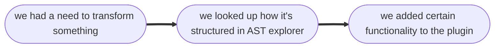
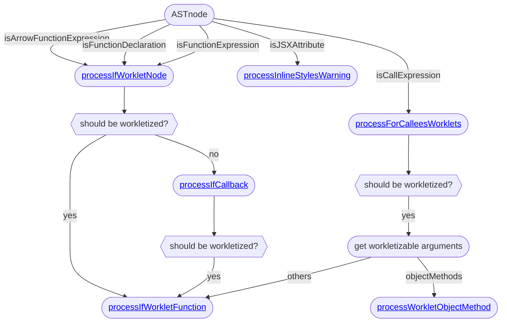

# Reanimated Babel plugin

To compile it, either use `yarn` or explicitly use `yarn plugin` in the root directory or `yarn` in `plugin/`.
If you want to make any changes to Reanimated Babel plugin, do not edit anything in `build/` or `lib/`, those are directories for automatically bundled files. Commit your changes to `.ts` files in `src/` instead and make sure to compile them afterwards.

Use of `yarn watch` in `plugin/` is highly recommended, as it will automatically compile and bundle your changes for testing and committing.

If you want to compile `lib/` files only, use `yarn tsc` (or if you want to keep them).
If you want to build the plugin but without using explicit `yarn`, do `yarn generate` instead.

## Table of contents:

1. [Basics](#basics)
   1. [Why do we need this plugin?](#why-do-we-need-this-plugin)
   1. [What is a worklet?](#what-is-a-worklet)
   1. [How does a worklet work?](#how-does-a-worklet-work)
   1. [Why transform worklets?](#why-transform-worklets)
   1. [Automatic workletization](#automatic-workletization)
   1. [Something doesn't work!](#something-doesnt-work-in-reanimated-plugin)
1. [Plugin's applications](#plugins-applications)
   1. [What can be a worklet?](#what-can-be-a-worklet)
   1. [Inline styles support](#inline-styles-support)
   1. [How to debug?](#how-to-debug-reanimated-babel-plugin)
1. [Implementation](#implementation)
   1. [Logic flowchart](#reanimated-babel-plugin-flowchart)
   1. [Plugin's dependencies](#dependencies-of-reanimated-babel-plugin)

## Basics

### Why do we need this plugin?

Reanimated is all about executing the code directly on the UI thread whenever possible to avoid expensive and troublesome communication between those two threads. Since UI and JS (React-Native) contexts are separate, we somehow need to pass the functions (and their arguments) from the JS thread to the UI thread. That's why we need **worklets**. If you haven't yet, we strongly recommend reading [the official documentation on worklets](https://docs.swmansion.com/react-native-reanimated/docs/fundamentals/glossary/#worklet) first.

### What is a worklet?

Worklets are **Arrow Function Expressions**, **Function Declarations**, **Function Expressions**, or **Object Methods** (for more information, refer to [official ECMAScript](https://262.ecma-international.org/), [types in Babel](https://babeljs.io/docs/babel-types), [AST Explorer](https://astexplorer.net/) - with @babel/parser) that contain a `'worklet'` directive at their very top. And that's it. It might be quite disappointing, but all the fun begins once we make such a worklet. It's a function that can be called on JS and UI threads. That's why Reanimated is able to produce smooth and responsive animations - functions that control those animations are not executed on JS thread, from where their results would need to be transported to UI thread and then applied.

### How does a worklet work?

The sole principle is (seemingly) simple. Once the Babel parser has transformed the code of the worklet function it appends some information to the function (since functions are objects in JavaScript). Once `runOnUI` has been called with our worklet, this extra information, which mostly is just JavaScript code, is injected into UI thread. Then UI thread calls `eval`, on this code and is happily able to run it autonomously.

If it's just `eval` you might ask:

### Why transform worklets?

Well, we have to remember that UI thread is a completely different context. It does not have access to the scope we called the function from, nor anything present on the JS thread. Obviously, we could just copy the entire JS thread and inject it into the UI, but that's in direct conflict with one of Reanimated's principles - _speed_. We want to inject _as little data as possible_ - that's why we don't copy the context and we don't copy all the function closures. We only copy the variables we need (that are used in the worklet) and pass _only them_. For that, we need some transforming and transforming only for the parts that we will need to inject. But we can do better. One of Reanimated's strong points is transparency. We can just inject some code into the UI thread, why not, but once something crashes, we'd like to know what. That's why we also append some debugging information - reference to the original code - using simple source maps. That allows us to get information about what failed in the worklet even though it was executed on another thread. Pretty neat, right?

To sum up, the process of worklet transformation appends to the JS function:

- its UI code (as a string),
- closure with only required variables,
- debugging information (source maps).

### Automatic workletization

You might have asked yourself: is that it? Of course not. Reanimated Plugin does a lot more than that. We also perform _automatic workletization_. It's a functionality that allows the developers to have less boilerplate code. When you use `useAnimatedStyle` or `useAnimatedGestureHandler` we **cannot** give them non-worklet functions. So, simply put, Plugin detects if it should workletize a non-worklet function and then workletizes it. Thanks to it, we can type:

```TypeScript
 const scrollHandler = useAnimatedScrollHandler({
    onScroll: (e) => {
      position.value = e.contentOffset.x;
    },
    onEndDrag: (e) => {
      scrollToNearestItem(e.contentOffset.x);
    },
    onMomentumEnd: (e) => {
      scrollToNearestItem(e.contentOffset.x);
    },
  });
```

instead of

```TypeScript
 const scrollHandler = useAnimatedScrollHandler({
    onScroll: (e) => {
      'worklet';
      position.value = e.contentOffset.x;
    },
    onEndDrag: (e) => {
      'worklet';
      scrollToNearestItem(e.contentOffset.x);
    },
    onMomentumEnd: (e) => {
      'worklet';
      scrollToNearestItem(e.contentOffset.x);
    },
  });
```

This might not seem to be a lot but it really helps with development and allows us to delegate some tedious tasks to babel.

### Something doesn't work in Reanimated Plugin!

It's certainly possible. It was being created ad-hoc from our experience and needs, not pre-planned in general:



Some use cases might've been overlooked and on the other hand - some might work but were not designed (considered) to be transformed. That's why we strongly suggest that before you do something unusual with Reanimated you should check if it's conforming to Plugin. If it's not and you think it would be useful - you are more than welcome to contribute and submit a pull request on our [repo](https://www.github.com/software-mansion/react-native-reanimated).

## Plugin's applications

To get some more information about certain edge cases or use cases not listed here, try looking them up in our [tests](https://github.com/software-mansion/react-native-reanimated/blob/main/__tests__/plugin.test.ts).

### What can be a worklet?

As stated in [this paragraph](#what-is-a-worklet), a worklet is supposed to be one of those:

- Arrow Function Expression:

```TypeScript
const foo = () => {
  'worklet';
  console.log('Hello from ArrowFunctionExpression');
}
```

- Function Declaration:

```TypeScript
function foo (){
  'worklet';
  console.log('Hello from FunctionDeclaration');
}
```

- Function Expression:

```TypeScript
const foo = function () {
  'worklet';
  console.log('Hello from FunctionExpression');
};
```

- Object Method:

```TypeScript
const obj = {
  foo() {
    'worklet';
    console.log('Hello from ObjectMethod');
  },
};
```

In addition, workletization will work with:

- Sequence Expression (only last element):

```TypeScript
function foo() {
  (0, bar, foobar)({ // only foobar will get workletized!
    barfoo() {
      'worklet';
      console.log('Hello from Sequence Expression');
    },
  });
}
```

### Inline styles support

For more information read [official docs](https://docs.swmansion.com/react-native-reanimated/docs/fundamentals/glossary/#animations-in-inline-styling).

### How to debug Reanimated Babel plugin?

It's simple. After compilation we have generated `.js.map` file. We strongly recommend using **Visual Studio Code** and **JavaScript Debug Terminal**. Just open a new debugging session, type in your terminal (in project's root directory) `yarn babel <filename>` or `npx babel <filename>` respectively, and voilà. Add some breakpoints in `plugin/src/` in files that are of your debugging interest or just use step-by-step tools. Some knowledge of JavaScript's AST and Babel will be required to understand what exactly is happening during code transformation, as it's quite a complicated process.

## Implementation

### Reanimated Babel plugin flowchart

This flowchart represents the high-level logic of our plugin's control flow. It's not perfect at the moment and one of our goals is to make this graph more understandable and fix all the gaps and remove unnecessary steps in its logic through meticulous refactoring of the code, but hey, at least it's planar!



### Dependencies of Reanimated Babel plugin

This topic is a bit difficult. Our philosophy at the moment is to keep everything required to _build_ plugin in `plugin/package.json` as _devDependencies_ and everything that is needed to _run_ plugin in main `package.json`, mostly as _devDependencies_.

This might seem a bit weird regarding two issues:

- Why are they not fully in `plugin/package.json`?
- Why are some dependencies **required to run** devDependencies?

It's understandable that dependencies required to run plugin are not in `plugin/package.json`, as plugin itself is not a dependency required by Reanimated thus its' dependencies wouldn't ever be installed by the user.

The hard part begins if we consider the latter issue.
The fact is, from theoretical perspective, dependencies required to run should just be _dependencies_, not _dev_ ones. But in reality, all of those listed as _devs_ are _dependencies_ for _dependencies_ of _react-native_ ( :dizzy*face: ) - hence, if user doesn't have them, react-native won't (or shouldn't) work at all.
What is more, we want to avoid potential issues with forcing users to install multiple versions of the same package. Thus, the solution is to \_trust* that user will have those packages and NodeJS will be able to resolve them for the plugin. The only thing we can do is to list them as _peerDependencies_ for clarity and to simplify potential troubleshooting and keep them as _devDependencies_ for us to be sure we have them.
It's not an ideal solution, but definitely best we have at the moment.

Keep in mind this was the situation as of March 2023.

Dependencies that are required for plugin to run:

- `@babel/core`,
  included in it as _dependencies_:
  - `@babel/traverse`,
  - `@babel/generator`,
- `convert-source-map`,
- `@babel/preset-typescript`,
- `@babel/@babel/plugin-transform-shorthand-properties`,
- `@babel/plugin-transform-shorthand-properties`,
- `@babel/plugin-transform-arrow-functions`,
- `@babel/plugin-proposal-optional-chaining`,
- `@babel/plugin-proposal-nullish-coalescing-operator`,
- `@babel/plugin-transform-template-literals`.
